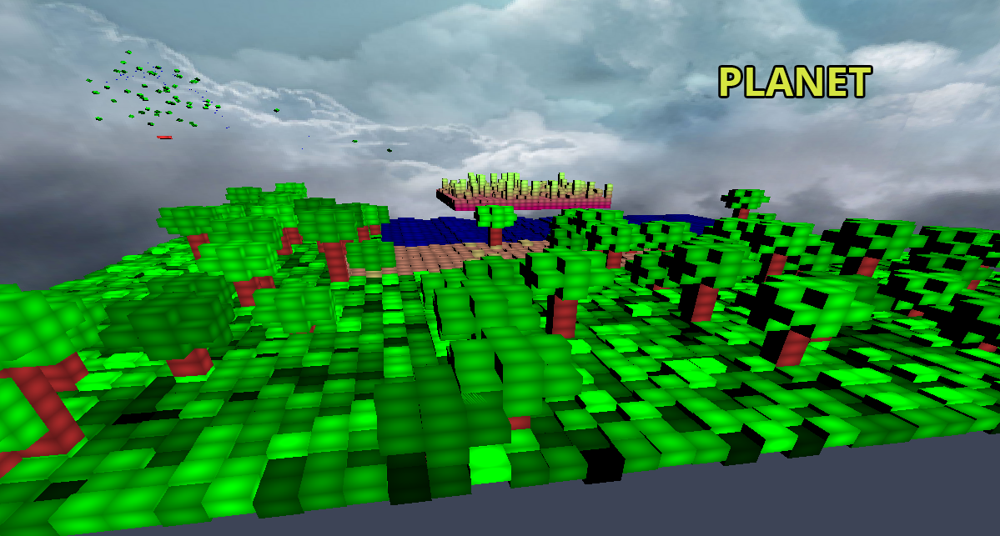
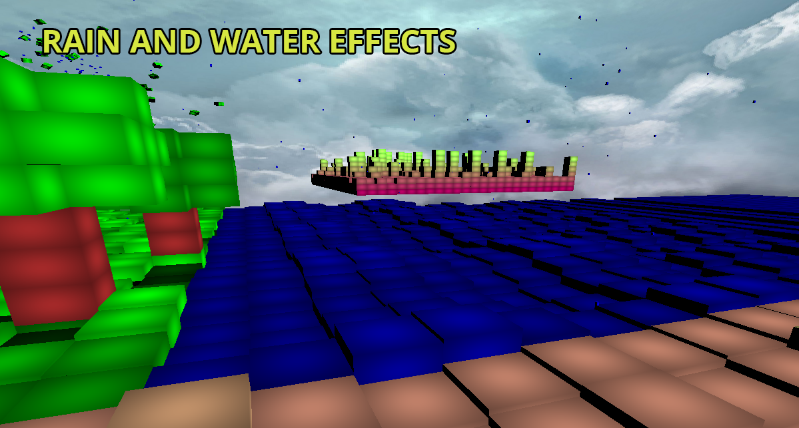
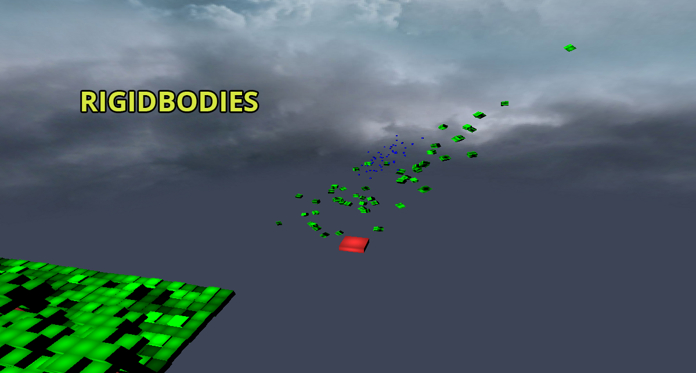
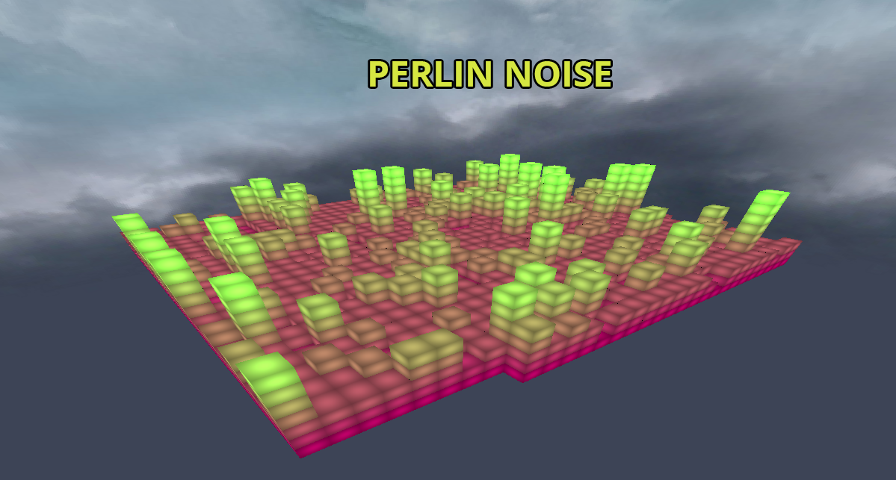

# CGP-OpenGL-project
Project created for educational purposes. Quality of code wasn't evaluated (fast typing). Subject: Computer Games programming.
Simple world made in OpenGL freeglut.
Things used in project:
<ul>

<li>Rigidbodies and particles,</li>
<li>Water effects using sinus and cosinus,</li>
<li>Movement on curve,</li>
<li>Object pooling like rain effect (Button P to enable),</li>
<li>Terrain generation using perlin noise (for diffrent heights),</li>
<li>Simple camera movement (Buttons Q E W S A D),</li>
<li>It is possible to move generated Trees up and down using N and M button. </li>
</ul>
To use M button u need to turn off N first!

Read if u want to compile yourself.
In order to compile it properly u need to change all directories to yours.
I used codeblocks for development. There might be some small diffrences on using diffrent tools like VS.

Screens:

